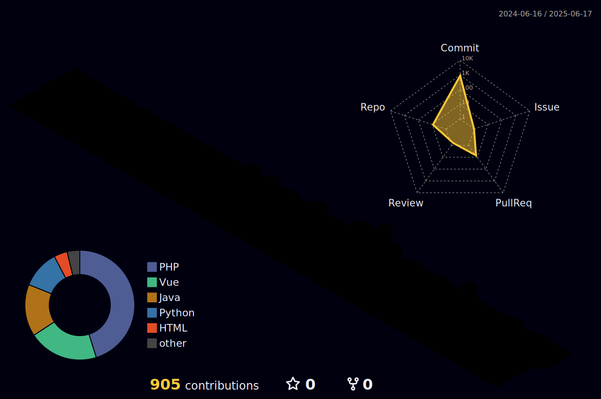

---



---

### 🛠 Tech Stack

```ts
type MyStack = {
  languages: "Java" | "Python" | "PHP" | "TypeScript📚";
  frontend: "Vue" | "React📚";
  backend: "Express" | "Laravel" | "NetsJS📚";
  database: "MySQL" | "MongoDB" | "Redis";
  ai: "PyTorch";
  container: "Docker"
};
```

### 📊 GitHub Stats
<div align="center"> 
  <!--START_SECTION:waka-->


**🐱 My GitHub Data** 

> 📦 164.6 kB Used in GitHub's Storage 
 > 
> 🏆 905 Contributions in the Year 2025
 > 
> 🚫 Not Opted to Hire
 > 
> 📜 20 Public Repositories 
 > 
> 🔑 0 Private Repositories 
 > 
**I'm a Night 🦉** 

```text
🌞 Morning                147 commits         ██░░░░░░░░░░░░░░░░░░░░░░░   06.41 % 
🌆 Daytime                539 commits         ██████░░░░░░░░░░░░░░░░░░░   23.51 % 
🌃 Evening                1047 commits        ███████████░░░░░░░░░░░░░░   45.66 % 
🌙 Night                  560 commits         ██████░░░░░░░░░░░░░░░░░░░   24.42 % 
```
📅 **I'm Most Productive on Saturday** 

```text
Monday                   377 commits         ████░░░░░░░░░░░░░░░░░░░░░   16.44 % 
Tuesday                  306 commits         ███░░░░░░░░░░░░░░░░░░░░░░   13.34 % 
Wednesday                262 commits         ███░░░░░░░░░░░░░░░░░░░░░░   11.43 % 
Thursday                 281 commits         ███░░░░░░░░░░░░░░░░░░░░░░   12.25 % 
Friday                   313 commits         ███░░░░░░░░░░░░░░░░░░░░░░   13.65 % 
Saturday                 514 commits         ██████░░░░░░░░░░░░░░░░░░░   22.42 % 
Sunday                   240 commits         ███░░░░░░░░░░░░░░░░░░░░░░   10.47 % 
```


📊 **This Week I Spent My Time On** 

```text
🕑︎ Time Zone: Asia/Seoul

💬 Programming Languages: 
Other                    13 hrs 48 mins      ███████░░░░░░░░░░░░░░░░░░   26.64 % 
TypeScript               12 hrs 43 mins      ██████░░░░░░░░░░░░░░░░░░░   24.56 % 
JavaScript               10 hrs 37 mins      █████░░░░░░░░░░░░░░░░░░░░   20.51 % 
Vue.js                   9 hrs 12 mins       ████░░░░░░░░░░░░░░░░░░░░░   17.77 % 
HTTP Request             2 hrs 1 min         █░░░░░░░░░░░░░░░░░░░░░░░░   03.92 % 

🔥 Editors: 
WebStorm                 21 hrs 57 mins      ███████████░░░░░░░░░░░░░░   42.38 % 
VS Code                  13 hrs 40 mins      ███████░░░░░░░░░░░░░░░░░░   26.40 % 
Notion                   12 hrs 28 mins      ██████░░░░░░░░░░░░░░░░░░░   24.08 % 
Postman                  2 hrs 1 min         █░░░░░░░░░░░░░░░░░░░░░░░░   03.92 % 
Notes                    1 hr 3 mins         █░░░░░░░░░░░░░░░░░░░░░░░░   02.04 % 

🐱‍💻 Projects: 
frontend-lab             25 hrs 33 mins      ████████████░░░░░░░░░░░░░   49.30 % 
cs25-2-gsc-portal-web    12 hrs 6 mins       ██████░░░░░░░░░░░░░░░░░░░   23.35 % 
cs25-2-gsc-portal-api    8 hrs 41 mins       ████░░░░░░░░░░░░░░░░░░░░░   16.76 % 
vue-practice             2 hrs 49 mins       █░░░░░░░░░░░░░░░░░░░░░░░░   05.47 % 
python-object            2 hrs 16 mins       █░░░░░░░░░░░░░░░░░░░░░░░░   04.38 % 

💻 Operating System: 
Mac                      51 hrs 49 mins      █████████████████████████   100.00 % 
```

**I Mostly Code in Python** 

```text
Python                   6 repos             ███████░░░░░░░░░░░░░░░░░░   28.57 % 
TypeScript               3 repos             ████░░░░░░░░░░░░░░░░░░░░░   14.29 % 
JavaScript               3 repos             ████░░░░░░░░░░░░░░░░░░░░░   14.29 % 
Vue                      2 repos             ██░░░░░░░░░░░░░░░░░░░░░░░   09.52 % 
Blade                    1 repo              █░░░░░░░░░░░░░░░░░░░░░░░░   04.76 % 
```


**Timeline**


 Last Updated on 03/11/2025 12:43:33 UTC
<!--END_SECTION:waka-->
</div>
<div align="center">
  
</div>
<br />
<div align="center">
  
</div>


---

### 📫 Connect with me:
<p align="center">
  <a href="https://www.instagram.com/_ias.kim/">
    
  </a>
  &nbsp;
  <a href="mailto:abcqkdnxm@g.yju.ac.kr">
    
  </a>
</p>


<p align="center">
  <a href="https://wakatime.com/@8271be3c-01e8-4db1-bc77-d61f9e69c1e6">
    
  </a>
</p>

